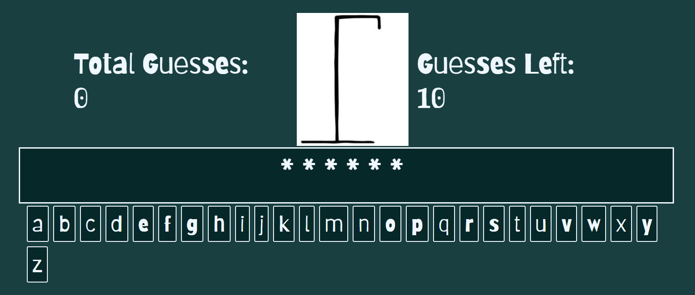

# Hang The Man

## Introduction
Hangman Game is a project that showcases the implementation of a classic hangman game using HTML, CSS, and JavaScript. Players can interact with the game, guessing letters to complete a hidden word while avoiding mistakes.

Live Link: [Hangman Game Live Link](https://your-github-username.github.io/hangman-game/)

## Goals
- Allow players to guess letters and find out what the secret word is.
- Provide an enjoyable gaming experience with visually appealing design and user-friendly interface.

## Features
### Landing Page
The landing page introduces the Hang The Man prject as an image of the platform is presented along with the hidden word presented as astericks, a selection of all available letters to select can be found just above the footer. 

### Interactive Gameplay
Players can click on the letter buttons to guess letters. The game updates the display with correctly guessed letters and the hangman figure as needed.

### Win and Lose Conditions
The game tracks the player's progress and provides feedback on whether the player has won by correctly guessing the word or lost by using all of the available attempts.

### Restart Game
Restarting the game is done by refreshing the page, winning or losing.

## How to Play
1. Visit the live link: [Hangman Game Live Link](https://your-github-username.github.io/hangman-game/)
2. Click on the letter buttons to guess letters and complete the word.
3. Guess the word before running out of attempts.

## Testing
Browsers tested include Chrome, Firefox, Safari, and Edge. All tested browsers displayed the game correctly, maintaining its functionality and design.

All HTML passed through the W3C Validator. All CSS passed through the Jigsaw Validator. All javascript passed through the JSHINT.

## Deployment
The Hangman Game project was deployed using GitHub Pages. Here are the deployment steps:
1. Navigate to the Settings tab of your GitHub repository.
2. In the GitHub Pages section, select the Master Branch as the source.
3. After selecting the Master Branch, the live link will be displayed indicating the successful deployment.

Live Link: [Hangman Game Live Link](https://your-github-username.github.io/hangman-game/)

## Credits
### Images
- Hangman figure parts found at the following link. [Image Source](https://www.amazon.com/Hangman-Game-Engraved-Rubber-Pieces/dp/B01ELRK9S0), which will not be used for any other reason than this project for demonstration.

### Acknowledgements
- The hangman game concept and design were inspired by classic hangman games.
- Help with understanding image overlapping in flexbox provided in this video: [Flexbox translating](https://www.youtube.com/embed/qyQm8YeGMJQ?si=QeO3j5dq2CWV3Xts)

## Bugs and Improvements
- Visual bugs may occur on certain screen sizes, but they can be addressed with better use of the flexbox feature.
- Future improvements may include enhancing the game's visual design, adding sound effects, and providing more word options or difficulty levels.
- By better utilisation of flexbox and by making use of svg images being able to position the image would not only be easier, but function more efficiently than within this project.